<!--
**Tadjaur/tadjaur** is a ✨ _special_ ✨ repository because its `README.md` (this file) appears on your GitHub profile.

Here are some ideas to get you started:

- 🔭 I’m currently working on ...
- 🌱 I’m currently learning ...
- 👯 I’m looking to collaborate on ...
- 🤔 I’m looking for help with ...
- 💬 Ask me about ...
- 📫 How to reach me: ...
- 😄 Pronouns: ...
- ⚡ Fun fact: ...
-->

<h1 align="center">Hi 👋, I'm Tadjening Aurelien</h1>
<h2 align="center">Full Stack Developer</h2>

I have rich experience in flutter and NodeJS.

<strong>Dart | Javascript | Flutter | Go | Firebase | NodeJS | NestJS</strong>

---

- 🔭 I’m currently working on Flutter, Firebase and Nodejs
- 🌱 I’m currently learning React, MongoDB, NextJS
- 💬 Ask me about Flutter, Firebase, NestJS
- 📫 How to reach me: [LinkedIn](https://www.linkedin.com/in/aurelien-tadjaur-772558143)

## Languages and tools

<code></code>
<code></code>
<code></code>
<code></code>
<code></code>

### GitHub stats

### Top Repositories

